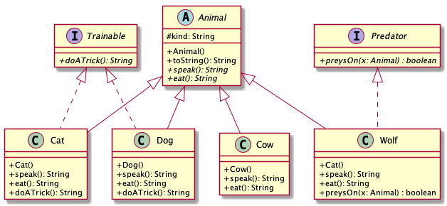
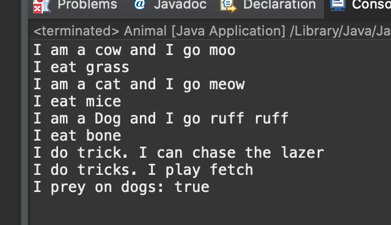

# Animals report
Author: Thien Nguye 

## UML class diagram
```
@startuml
skinparam classAttributeIconSize 0
abstract class Animal{
# kind: String
+Animal()
+toString(): String
+{abstract} speak(): String
+{abstract} eat(): String
}

class Cat{
+Cat()
+speak(): String
+eat(): String
+doATrick(): String
}

class Cow{
+Cow()
+speak(): String
+eat(): String
}

class Dog{
+Dog()
+speak(): String
+eat(): String
+doATrick(): String
}

class Wolf{
+Cat()
+speak(): String
+eat(): String
+preysOn(x: Animal) : boolean
}

interface Trainable{
+{abstract} doATrick(): String
}

interface Predator{
+{abstract} preysOn(x: Animal) : boolean
}

Class Cat extends Animal
Class Cat implements Trainable

Class Dog extends Animal
Class Dog implements Trainable

Class Cow extends Animal

Class Wolf extends Animal
Class Wolf implements Predator

@enduml
```

## Answers to Questions in step 6
###Option 1: Trainable pet1 = new Cow()
	This option is not valid because the Cow class does not implement the Trainable interface 
###Option 2: Animal pet2 = new Cat(); System.out.println(pet2.doATrick());
	This option is not valid because pet2 is an Animal class and the class does not implement the Trainable interface
###Option 3: Animal pet3 = new Cat(); System.out.println(((Trainable)pet3).doATrick());
	This option works as pet3 was type casted into the Trainable class. Hence it will be able to use the doATrick() method. Type casting pet3 into the Cat subclass will also work.

## Execution and Testing

