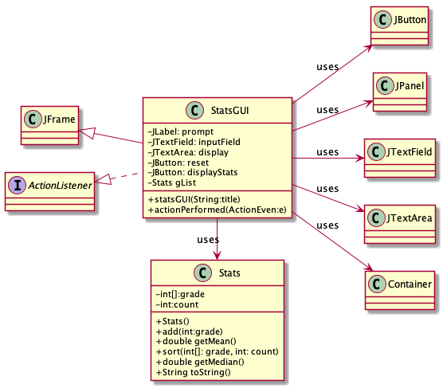
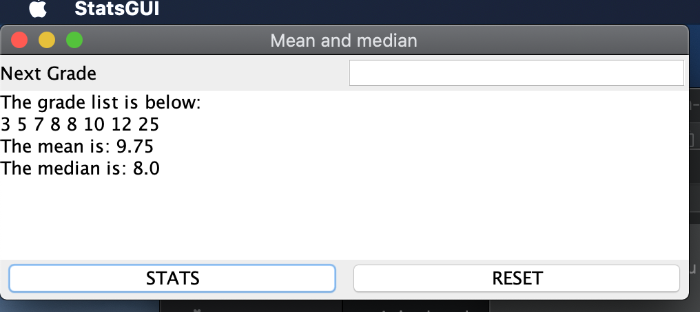
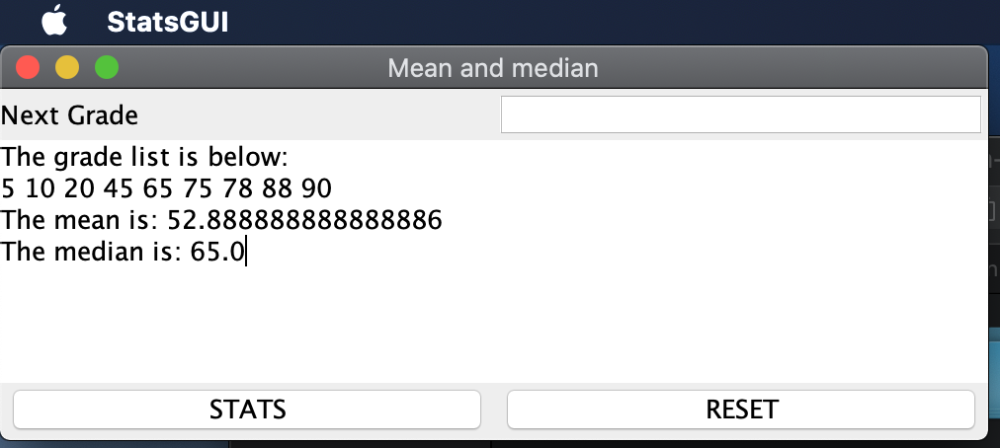

# Stats report
Author: Thien Nguyen

## UML class diagram
```
@startuml
left to right direction
skinparam classAttributeIconSize 0

class JFrame

class StatsGUI{
-JLabel: prompt
-JTextField: inputField
-JTextArea: display
-JButton: reset
-JButton: displayStats
-Stats gList
+statsGUI(String:title)
+actionPerformed(ActionEven:e)
}

class Stats{
-int[]:grade
-int:count
+Stats()
+add(int:grade)
+double getMean()
+sort(int[]: grade, int: count)
+double getMedian()
+String toString()
}

interface ActionListener

class JButton

class JPanel

class JTextField

class JTextArea

class Container

class StatsGUI extends JFrame
class StatsGUI implements ActionListener
StatsGUI -> Stats : uses
StatsGUI --> JTextArea : uses
StatsGUI --> JTextField : uses
StatsGUI --> Container : uses
StatsGUI --> JPanel : uses
StatsGUI --> JButton : uses
@enduml
```

## Execution and Testing

###Even Count Execution:


###Odd Count Executions:
